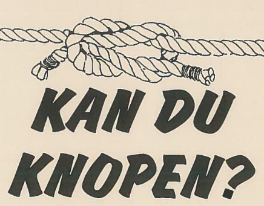

# E-lunta

- **Kan du knopen? – Knopspåret**  
  _Introduktion_  
  [Download PDF](pdfs/kanduknopen.pdf)  
  
[{ width="150" style="border-radius:12px;" }](pdfs/kanduknopen.pdf)

- **Ovan molnen**  
  _Introduktion_  
  [Download PDF](pdfs/kanduknopen.pdf)  
  
[{ width="150" style="border-radius:12px;" }](pdfs/kanduknopen.pdf)

- **Naturnäran**  
  _Introduktion_  
  [Download PDF](pdfs/kanduknopen.pdf)  
  
[{ width="150" style="border-radius:12px;" }](pdfs/kanduknopen.pdf)

- **Träck track**  
  _Introduktion_  
  [Download PDF](pdfs/kanduknopen.pdf)  
  
[{ width="150" style="border-radius:12px;" }](pdfs/kanduknopen.pdf)

- **Kompismärket**  
  _Introduktion_  
  [Download PDF](pdfs/kanduknopen.pdf)  
  
[{ width="150" style="border-radius:12px;" }](pdfs/kanduknopen.pdf)

